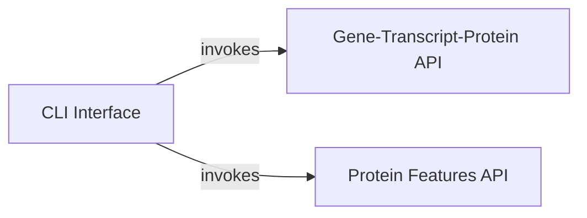

## Component Details

This system provides a command-line interface for interacting with two distinct APIs: one for retrieving gene-transcript-protein isoform structure data and another for fetching protein features. The CLI acts as the central entry point, parsing user commands and arguments, and subsequently invoking the appropriate API client function to retrieve and display the requested biological data.

### CLI Interface

Provides the command-line interface for the g2papi application, parsing user arguments and orchestrating calls to the G2P API Client based on the commands issued. It serves as the primary entry point for users to interact with the system.

**Related Classes/Methods**:

- <a href="https://github.com/broadinstitute/g2papi/blob/master/g2papi/cli.py#L4-L26" target="_blank" rel="noopener noreferrer">`g2papi.g2papi.cli.main` (4:26)</a>

### Gene-Transcript-Protein API

Responsible for interacting with an external service to retrieve gene-transcript-protein isoform structure data. It constructs the appropriate URL, makes an HTTP GET request, handles potential errors, and processes the response into a pandas DataFrame.

**Related Classes/Methods**:

- <a href="https://github.com/broadinstitute/g2papi/blob/master/g2papi/api.py#L7-L15" target="_blank" rel="noopener noreferrer">`g2papi.g2papi.api.get_gene_transcript_protein_isoform_structure` (7:15)</a>

### Protein Features API

Handles requests for protein feature data from an external service. It forms the request URL, performs an HTTP GET operation, checks for response errors, and converts the received data into a structured pandas DataFrame.

**Related Classes/Methods**:

- <a href="https://github.com/broadinstitute/g2papi/blob/master/g2papi/api.py#L18-L24" target="_blank" rel="noopener noreferrer">`g2papi.g2papi.api.get_protein_features` (18:24)</a>

### [FAQ](https://github.com/CodeBoarding/GeneratedOnBoardings/tree/main?tab=readme-ov-file#faq)