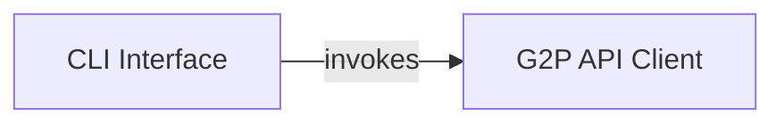

## Component Details

This system provides a command-line interface for interacting with an external G2P API. The CLI component parses user input and dispatches requests to the G2P API Client, which handles the actual HTTP communication, data retrieval (gene, transcript, protein isoform structures, and protein features), and initial processing of the API responses.

### G2P API Client

Encapsulates the logic for interacting with an external G2P API. It handles making HTTP requests to retrieve gene, transcript, and protein isoform structures, as well as protein features, and processes the received data (e.g., CSV parsing).

**Related Classes/Methods**:

- <a href="https://github.com/broadinstitute/g2papi/blob/master/g2papi/api.py#L7-L15" target="_blank" rel="noopener noreferrer">`g2papi.g2papi.api.get_gene_transcript_protein_isoform_structure` (7:15)</a>

- <a href="https://github.com/broadinstitute/g2papi/blob/master/g2papi/api.py#L18-L24" target="_blank" rel="noopener noreferrer">`g2papi.g2papi.api.get_protein_features` (18:24)</a>

### CLI Interface

Provides a command-line entry point for the g2papi system. It parses user arguments, determines the requested operation, and dispatches the request to the G2P API Client functions. It also handles the output of the results to the console.

**Related Classes/Methods**:

- <a href="https://github.com/broadinstitute/g2papi/blob/master/g2papi/cli.py#L4-L26" target="_blank" rel="noopener noreferrer">`g2papi.g2papi.cli.main` (4:26)</a>

### [FAQ](https://github.com/CodeBoarding/GeneratedOnBoardings/tree/main?tab=readme-ov-file#faq)