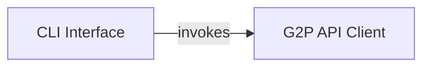

## Component Details

This architecture describes a command-line interface (CLI) application that interacts with an external G2P (Gene to Protein) API. The main flow involves the CLI parsing user commands and arguments, then invoking the appropriate functions within the G2P API Client to fetch and process biological data such as gene, transcript, and protein isoform structures, or protein features. The processed data is then typically outputted to the user.

### CLI Interface

Provides the command-line interface for the g2papi application, parsing user arguments and orchestrating calls to the G2P API Client based on the commands issued. It serves as the primary entry point for users to interact with the system.

**Related Classes/Methods**:

- <a href="https://github.com/broadinstitute/g2papi/blob/master/g2papi/cli.py#L4-L26" target="_blank" rel="noopener noreferrer">`g2papi.g2papi.cli.main` (4:26)</a>

### G2P API Client

Encapsulates the logic for interacting with an external G2P API. It handles making HTTP requests to retrieve gene, transcript, and protein isoform structures, as well as protein features, and processes the received data (e.g., CSV parsing).

**Related Classes/Methods**:

- <a href="https://github.com/broadinstitute/g2papi/blob/master/g2papi/api.py#L7-L15" target="_blank" rel="noopener noreferrer">`g2papi.g2papi.api.get_gene_transcript_protein_isoform_structure` (7:15)</a>

- <a href="https://github.com/broadinstitute/g2papi/blob/master/g2papi/api.py#L18-L24" target="_blank" rel="noopener noreferrer">`g2papi.g2papi.api.get_protein_features` (18:24)</a>

### [FAQ](https://github.com/CodeBoarding/GeneratedOnBoardings/tree/main?tab=readme-ov-file#faq)